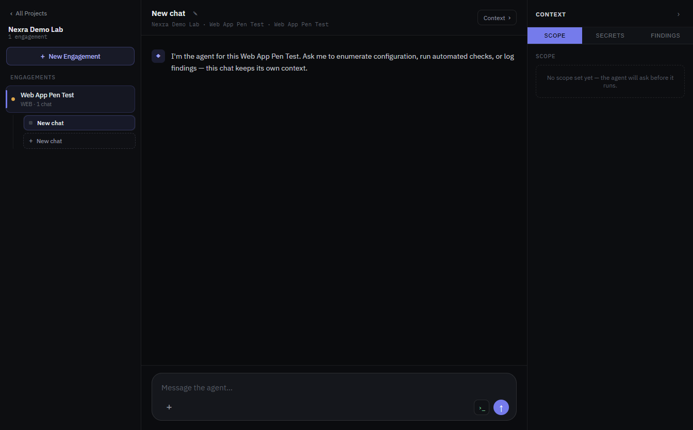
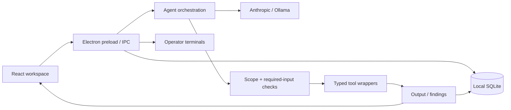

# Nexra.sh

**An AI agent workspace for security assessments.**

Nexra brings model conversations, security tools, findings and interactive terminals into one desktop application. It is built for an operator who needs to understand what an agent did, inspect the evidence, and decide when to move to the next assessment phase.

[](https://github.com/EthanChamps/Nexra.sh/actions/workflows/ci.yml)

**Status: working development prototype.** Live model integration, tool execution and local persistence are implemented. This is not a production-certified security product.



*Actual Windows application, using a fictional lab project. The welcome message is built in; this screenshot does not depict a completed scan or live model result.*

## What it demonstrates

- **Agent orchestration:** streaming conversations for AWS and Microsoft 365 reviews; schema-constrained decisions, bounded retries and phase budgets for web assessments.
- **Controls outside the model:** typed tool wrappers validate the requested target against engagement scope before launching a process. The model does not receive a general-purpose shell tool.
- **Evidence and persistence:** findings reference captured output or supplied evidence; projects, chats and findings survive restarts in SQLite.
- **Cloud or local inference:** Anthropic and Ollama are implemented through the Vercel AI SDK. Model choice is configurable.
- **Desktop integration:** React UI, Electron IPC, real node-pty terminals and OS-backed encryption for stored secret values.
- **Repeatable tests:** deterministic model/tool fixtures exercise scope rejection, credential handling, parsing, persistence and UI behaviour without paid API calls.

## Implemented integrations

| Area | Current implementation |
| --- | --- |
| AWS configuration reviews | Prowler, ScoutSuite and PMapper wrappers; tools and an authorised AWS account are external prerequisites. |
| Microsoft 365 reviews | ScubaGear wrapper with interactive sign-in or certificate-based app authentication; PowerShell and ScubaGear must be installed separately. |
| Web assessments | Docker wrappers for httpx, Katana, ffuf, Nuclei, a first-party headers/TLS checker and sqlmap. Phases: Map → Discover → Scan → Verify → Report. |
| Azure, internal and external pentest categories | Workspace categories exist; dedicated tool packs are not implemented. |
| Model providers | Anthropic and Ollama. OpenAI and Google adapters are not implemented. |

The **Report** phase is a workflow stage, not a finished report exporter. Tool wrappers being present does not imply that every external integration has been validated on every operating system.

## Run locally

Use **Node.js 22.12 or newer**, npm, and Windows or macOS. Native dependencies may require the platform's C++ build tools if a matching prebuilt binary is unavailable.

```bash
git clone https://github.com/EthanChamps/Nexra.sh.git
cd Nexra.sh/nexra
npm ci
npm run dev
```

The application starts with an empty workspace. No API key is needed to explore projects, engagements, settings and terminals.

1. Open **Settings** and choose Anthropic or Ollama.
2. Enter a model identifier available to your account, or the exact name of an installed Ollama model. For Ollama, the default endpoint is `http://localhost:11434`.
3. Save an Anthropic API key in Settings if using cloud inference, then use **Test connection**. This makes a small live request for Anthropic.
4. Create a project and engagement. Set a narrow scope for a lab or system you are authorised to assess.
5. Install the tools required by that engagement. Review findings and evidence before continuing through phases.

Cloud inference sends prompt context to the selected provider. Local storage does not mean cloud model calls stay on your machine. See [security boundaries](SECURITY.md).

### Web tool setup

Docker must be installed and running. Build the included headers checker from the repository root:

```bash
docker build -t nexra/web-headers-tls:latest nexra/docker/web-headers-tls
```

The other wrappers reference third-party Docker images and may download them on first use. They currently use mutable `latest` tags. Scope checks validate the initial URL; container network access and redirects are not constrained to that scope. Use an isolated lab for evaluation.

### Development commands

Run these inside `nexra/`:

```bash
npm test          # Unit/integration tests; no model credentials required
npm run build    # Typecheck and build renderer, main process and preload
npm run dev      # Launch the desktop application
npm run dist     # Build unsigned installers; not a published release
```

SQLite uses a native binary that differs between Node and Electron. The `pretest` and `predev` hooks rebuild it for the relevant runtime. Run tests and the desktop app sequentially, not simultaneously in the same checkout. Packaging is a separate verification step from `npm run build`.

## Architecture



The operator terminal is independent of the agent's restricted tool interface. It executes commands with the operator's local permissions.

For a guided code tour and design tradeoffs, read [Architecture](docs/ARCHITECTURE.md). For what the tests prove, see [Verification](docs/VERIFICATION.md).

## Limits and next steps

- Validate complete assessments against known lab results and publish model-quality, latency and cost measurements. Unit tests are not a live-model benchmark.
- Add network egress restrictions, immutable tool-image versions and stronger cloud account/credential binding.
- Complete report export and long-session memory integration.
- Finish cross-platform installer testing, signing and independent security review.

The `verified` finding flag means evidence is attached according to application rules. It does not establish that a vulnerability is real. A human must validate results.

## Development history and attribution

Developed with AI coding assistance. The original design notes and implementation plans are retained in [`docs/superpowers`](docs/superpowers) to show the project's evolution; they describe historical milestones and may contain superseded claims. This README and the current code describe the public prototype.

This repository is published for review and portfolio purposes. No open-source licence is granted at present; existing third-party components retain their own licences.
